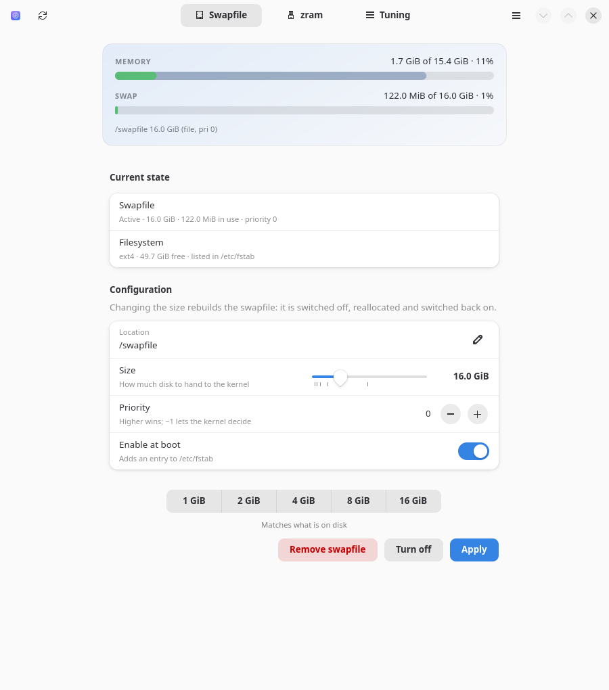
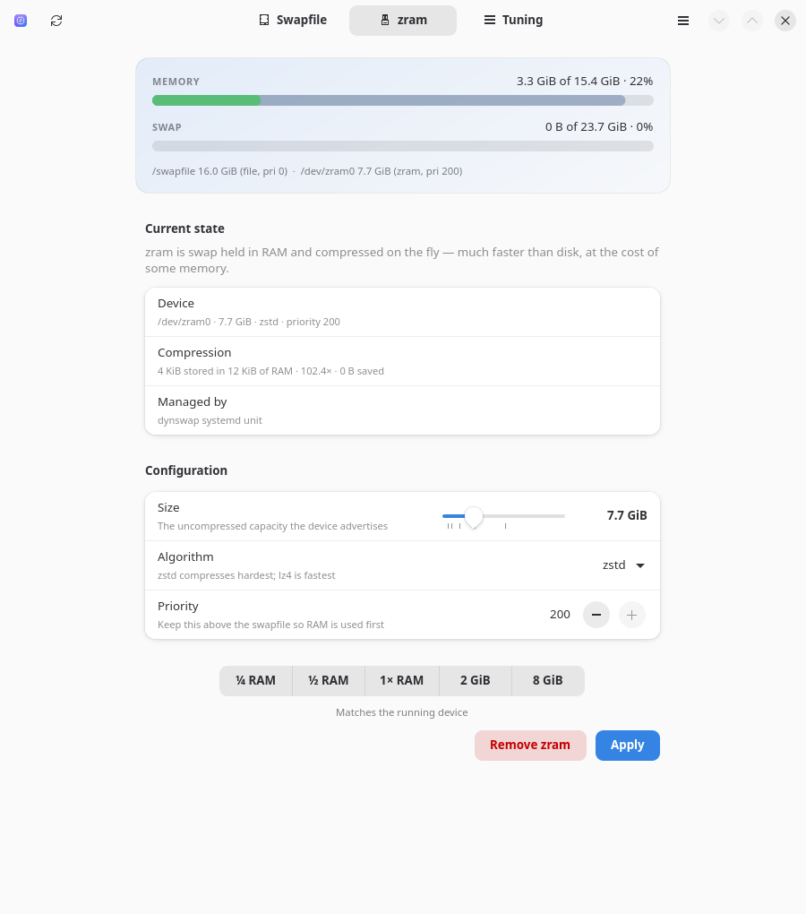
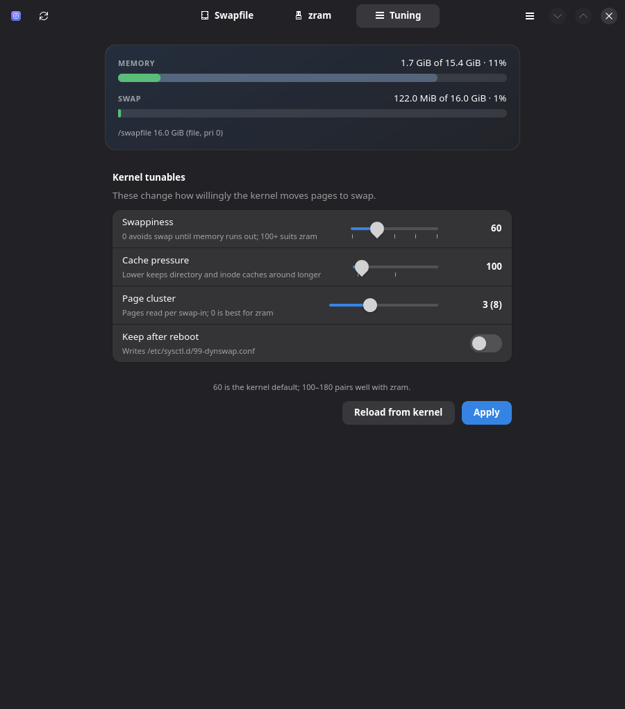

# dynSwap

Set the amount of swap space on a Linux system — from a terminal interface or a
desktop one. It manages a **swapfile**, a **zram** device and the **kernel
tunables** that decide how either gets used.

No Python packages to install: the TUI is stdlib `curses`, the GUI is GTK 4 and
libadwaita through the bindings your distribution already ships.

| Swapfile | zram | Tuning |
|---|---|---|
|  |  |  |

```

  dynSwap swap control                        1 device · 16.0 GiB · 122.0 MiB used
  ────────────────────────────────────────────────────────────────────────────────


   RAM  10% ████████████████████████████████░░░░░░░░  1.6 GiB / 15.4 GiB
   SWAP  1% ░░░░░░░░░░░░░░░░░░░░░░░░░░░░░░░░░░░░░░░░  122.0 MiB / 16.0 GiB
            █ used   █ cache   ░ free
            /swapfile  (file, priority 0)

    Swapfile   zram   Tuning   Log
  ─━━━━━━━━━━─────────────────────────────────────────────────────────────────────
  ╭──────────────────────────────────────────────────────────────────────────────╮
  │   Filesystem    ext4  ·  49.7 GiB free                                       │
  │   Status        active · 16.0 GiB · 122.0 MiB in use                         │
  │                                                                              │
  │   Location      /swapfile                                                    │
  │ ▸ Size          ██████████●░░░░░░░░░░░░░░░░░░░░░░░░░░░░░░░░░  16.0 GiB       │
  │   Priority      ░░░░░░░░░░░░░░░░░░░░░░░░░░░░░░░░░░░░░░░░░░░░  0              │
  │                                                                              │
  │   › 1-5 presets · shift ±1 GiB                                               │
  ╰──────────────────────────────────────────────────────────────────────────────╯
  ────────────────────────────────────────────────────────────────────────────────
   ↹ tab  ↑↓ field  ←→ adjust  ⏎ apply  t on/off  d remove  R refresh  q quit
```

## Install

```sh
./install.sh                      # system-wide, into /usr (asks for sudo)
./install.sh --prefix=/usr/local  # somewhere else
./install.sh --prefix=~/.local    # no root needed; falls back to sudo at runtime
./install.sh --uninstall          # remove every installed file
```

The installer checks its dependencies before touching anything, and tells you
what is missing and how to get it on Arch, Debian/Ubuntu and Fedora.

## Use

```sh
dynswap            # GUI on a desktop session, TUI otherwise
dynswap --tui      # force the terminal interface
dynswap --gui      # force the graphical interface
dynswap --status   # print the current configuration and exit
```

### Keys in the TUI

| Key | Action |
|---|---|
| `Tab` / `[` `]` | switch page |
| `↑` `↓` | move between fields |
| `←` `→` | adjust the focused field (`Shift` for a bigger step) |
| `1`–`5` | jump a slider to a preset |
| `Home` / `End` | minimum / maximum |
| `Enter` | apply the page |
| `t` | switch the swapfile on or off |
| `d` | remove the swapfile / zram device |
| `R` | re-read system state |
| `q` | quit |

In the password dialog: `⏎` submit, `esc` cancel, `Ctrl-U` clear the field.

## What each page does

**Swapfile** — creates, resizes, enables, disables or deletes a swapfile
(`/swapfile` by default, or any path you type). Resizing means switching the
old one off, reallocating and switching it back on; dynSwap refuses if what is
already swapped out would not fit back in RAM. Allocation follows the
filesystem: `fallocate` on ext4, `btrfs filesystem mkswapfile` on btrfs, and a
full write elsewhere, because `fallocate` can leave extents that `swapon`
rejects. Optionally adds the `/etc/fstab` entry, with a backup of the old file.

**zram** — a compressed swap device that lives in RAM. Set its size, its
compression algorithm (whatever your kernel offers) and its priority. If
`systemd-zram-generator` is installed, dynSwap writes
`/etc/systemd/zram-generator.conf` and lets it do the work; otherwise it
installs its own `dynswap-zram.service`.

**Tuning** — `vm.swappiness`, `vm.vfs_cache_pressure` and `vm.page-cluster`,
applied live and optionally written to `/etc/sysctl.d/99-dynswap.conf`.

## How privileges work

The interfaces never touch the system. Everything that changes state goes
through one small program, `dynswap-helper`, which runs as root and validates
every argument itself:

```
  dynswap (your user)  ──►  pkexec / sudo  ──►  dynswap-helper (root)
        ▲                                              │
        └──────────  JSON progress events  ◄───────────┘
```

The helper will not overwrite a file that is not already swap, will not put a
swapfile under `/dev`, `/proc`, `/sys`, `/run` or `/tmp`, and will not switch
off swap that could not fit back into memory.

### Asking for the password

Both interfaces ask for it themselves, and only when a change is actually about
to happen — browsing costs nothing.

The **GUI** goes through `pkexec`, so you get your desktop's own polkit dialog.
The polkit policy `de.synthelicz.dynSwap.manage` is what puts a real
description in it instead of a bare path. Minimal Wayland sessions often run no
polkit agent at all, which leaves `pkexec` nobody to ask; dynSwap notices and
shows its own password dialog instead, checking the password through `sudo`.

The **TUI** asks in its own dialog, without leaving the screen:

```

  dynSwap swap control                        1 device · 16.0 GiB · 122.0 MiB used
  ────────────────────────────────────────────────────────────────────────────────


   RAM  10% ████████████████████████████████░░░░░░░░  1.6 GiB / 15.4 GiB
   SWAP  1% ░░░░░░░░░░░░░░░░░░░░░░░░░░░░░░░░░░░░░░░░  122.0 MiB / 16.0 GiB
           ╭─ Authentication ───────────────────────────────────────────╮
           │                                                            │
           │  Changing swap needs administrator rights.                 │
    Swapfil│                                                            │
  ─━━━━━━━━│  Password for you                                          │─────────
  ╭────────│   ●●●●●●●▏                                                 │────────╮
  │   Files│  ────────────────────────────────────────────────────────  │        │
  │   Statu│                                                            │        │
  │        │  ⏎ authenticate   esc cancel                               │        │
  │   Locat│                                                            │        │
  │ ▸ Size ╰────────────────────────────────────────────────────────────╯B       │
  │   Priority      ░░░░░░░░░░░░░░░░░░░░░░░░░░░░░░░░░░░░░░░░░░░░  0              │
  │                                                                              │
  │   › 1-5 presets · shift ±1 GiB                                               │
  ╰──────────────────────────────────────────────────────────────────────────────╯
  ────────────────────────────────────────────────────────────────────────────────
   ↹ tab  ↑↓ field  ←→ adjust  ⏎ apply  t on/off  d remove  R refresh  q quit
```

Typing is masked, backspace removes whole characters rather than bytes,
`Ctrl-U` clears the field, `esc` cancels, and you get three attempts. The
password goes to `sudo` down a pipe — it never reaches the terminal or the
process list. A success leaves the usual `sudo` ticket, so a run of changes only
asks once.

That dialog works the same on a bare console and over SSH, where no polkit
agent exists. If `sudo` is not installed at all, dynSwap hands the terminal to
`pkexec` for the length of the run and takes it back afterwards.

## Files dynSwap may write

| Path | When |
|---|---|
| `/swapfile` (or your path) | creating or resizing a swapfile |
| `/etc/fstab` | “Enable at boot”; the previous file is kept as `/etc/fstab.dynswap.bak` |
| `/etc/sysctl.d/99-dynswap.conf` | “Keep after reboot” on the Tuning page |
| `/etc/systemd/zram-generator.conf` | applying zram where zram-generator is installed |
| `/etc/systemd/system/dynswap-zram.service` | applying zram anywhere else |

Uninstalling removes the program, never your swap; `install.sh --uninstall`
prints the commands to undo the rest.

## Requirements

- Linux, Python 3.9+
- `util-linux` (`mkswap`, `swapon`, `swapoff`, `findmnt`; `zramctl` for zram)
- `polkit` for the graphical password prompt, or `sudo`
- GTK 4 + libadwaita + PyGObject for the GUI — the TUI needs none of it

## Running from a checkout

```sh
python3 -m dynswap --tui
python3 -m dynswap --gui
```

`dynswap-helper` in the project root is picked up automatically, so an
uninstalled checkout works the same way.

## Licence

MIT.
